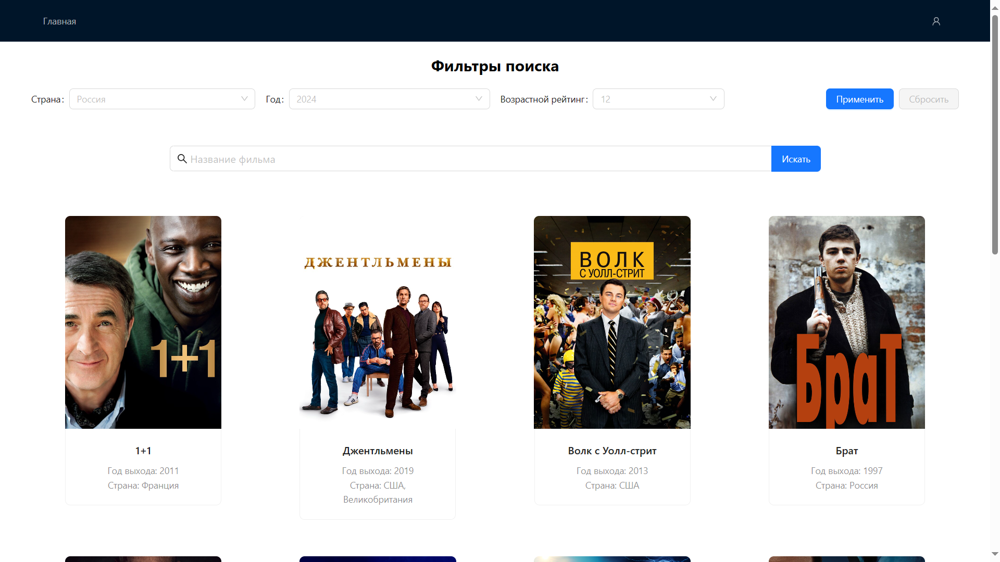

# Тестовое задание для стажировки в Авито

## Технологии

- React ^18.2
- react-router-dom v6
- TypeScript
- Webpack
- axios
- Docker
- Ant-Design
- Node.js 18
- пакетный менеджер: npm

## Приложение



## Установка и запуск

Установка зависимостей:

```
npm install
```

Запуск проекта:

```
TOKEN=<ваш токен> npm run start
```

## Развернуть Docker контейнер


Сборка образа (из директории репозитория)

```
docker build -t avito-app .
```

Запуска контейнера с токеном

```
docker run -p 7070:7070 avito-app
```

## Реализованный функционал:

### На странице со списком всех фильмов:

- Отображается список фильмов и сериалов
- Реализована пагинация
- Можно выбрать количество фильмов для показа на странице (по умолчанию должно быть 10)
- Можно отфильтровать выдачу (по году, стране и возрастному рейтингу)
- Реализован поиск по названию фильма
- Можно перейти на страницу фильма из выдачи

- Возможность поделиться результатами выдачи с другими пользователями через копирование ссылки
- Сохраняется история поиска
- При вводе нового названия появляется suggest с предложениями из ранее введенных значений
- При вводе значений происходит фильтрация подсказок по вхождению

### На странице с отдельным фильмом:

Отображается информация о фильме или сериале, в том числе:

- название фильма/сериала
- описание
- рейтинг
- список актёров (с пагинацией, если их больше 10);
- список сезонов и серий (с пагинацией, если они подразумеваются)
- отзывы пользователей (с пагинацией)
- постеры, отображение которых реализовано в виде «карусели»

- Реализован вывод списка фильмов, похожих на текущий, в виде «карусели». По каждому элементу можно кликнуть и открыть его страницу
- В случае, если какой-то из списков пустой (список отзывов, актёров, сезонов), реализовано отображение заглушки на подобие «нет информации о ...»
- Реализована кнопка «назад», которая ведет на выдачу. Фильтры и номер страницы при этом должны сохраняться.

- Реализована авторизация
- Страница с рандомным фильмом доступна только после авторизации

### Нефункциональные требования:

- Реализован адаптивный интерфейс
- Роутинг выполнен с использованием React Router v6
- При переходах по ссылкам страница не перезагружается
- Запуск проекта в режиме разработчика должен происходить по команде TOKEN=<your api token> npm run start ; проект должен быть доступен по ссылке http://localhost:7070

- Используется TypeScript
- Есть docker-файл для запуска
- Реализация возможности выполнения трёх попыток повторного запроса, если запрос был неудачным

## Примеры запросов

Получение всех фильмов для главной страницы:
```
curl --request GET \
     --url 'https://api.kinopoisk.dev/v1.4/movie?page=1&limit=10' \
     --header 'X-API-KEY: token' \
     --header 'accept: application/json'
```

Получение фильмов с нужными полями и использованием фильтра по году:
```
curl --request GET \
     --url 'https://api.kinopoisk.dev/v1.4/movie?page=1&limit=10&selectFields=id&selectFields=name&selectFields=year&selectFields=poster&year=2022' \
     --header 'token' \
     --header 'accept: application/json'
```
Пример ответа:
```
{
  "docs": [
    {
      "id": 5079093,
      "name": "Монастырь",
      "poster": {
        "url": "https://image.openmoviedb.com/kinopoisk-images/4774061/ce90ef63-3c81-4aa7-95f0-f5bbe5123484/orig",
        "previewUrl": "https://image.openmoviedb.com/kinopoisk-images/4774061/ce90ef63-3c81-4aa7-95f0-f5bbe5123484/x1000"
      },
      "year": 2022
    },
    {
      "id": 927898,
      "name": "Переводчик",
      "year": 2022,
      "poster": {
        "url": "https://image.openmoviedb.com/kinopoisk-images/1898899/5c775217-8796-4c7a-aba8-e4c6d48a6c36/orig",
        "previewUrl": "https://image.openmoviedb.com/kinopoisk-images/1898899/5c775217-8796-4c7a-aba8-e4c6d48a6c36/x1000"
      }
    },
    ...,
    ...,
  ]
}

```

Получение фильма по id: 
```
curl --request GET \
     --url https://api.kinopoisk.dev/v1.4/movie/26278 \
     --header 'X-API-KEY: token' \
     --header 'accept: application/json'
```

Поиск фильма по названию:
```
curl --request GET \
     --url 'https://api.kinopoisk.dev/v1.4/movie/search?page=1&limit=10&query=везение' \
     --header 'X-API-KEY: token' \
     --header 'accept: application/json'
```


## Нюансы разработки

В API отсутствует метод для одновременного выполнения поисковых запросов по заголовку и фильтрации результатов. Также часто сервис был недоступен, что затрудняло разработку.
